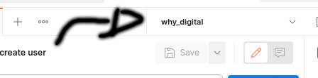
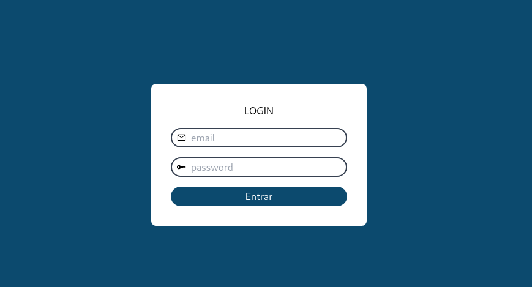

<div align="center">
 <h1> Projeto Why Digital</h1>
</div>

- Clone o projeto (caso você esteja usando windows, pelo wsl 2):

```
git clone https://github.com/HugooSantos/project_whydigital.git ; cd project_whydigital
```
- Dentro da pasta project_whydigital vamos copiar o .env.example do laravel e já fazer as alterações necessárias:

```
cp backend/.env.example backend/.env
```

- Vamos usar o docker e o docker compose como ambiente de desenvolvimento/teste, caso não o tenha instalado você pode baixa-los por aqui (caso a sua distro não seja debian você pode mudar a esquerda para sua distro):
- [docker](https://docs.docker.com/engine/install/debian/) 
- [docker-compose](https://docs.docker.com/compose/install/) 

- Iremos rodar o composer install:
```
cd backend ; composer install --ignore-platform-reqs  ; cd ..
```

- Vamos dar permissão ao comando sh e executa-lo para subir os containers :

- Primeiro:

```
sudo chmod 777 runProject.sh
```

- Segundo:

```
./runProject.sh 
```

- Esse processo pode demorar um pouco, então que tal já irmos importando a sua colection do postman? 

> Collection : [Collection](https://drive.google.com/uc?export=download&id=1ih6jmuBWi3DKKvuozR78kqxpVBdB9OTp) 

> Env : [env](https://drive.google.com/uc?export=download&id=1K5XAz-GAgayhIwF-l35IPxvTKAk3ILOG)


- Lembre de colocar o env do seu postman para facilitar o processo de teste:

<br>
<div align="center">
  
</div>
<br>


- Agora faremos algumas coisas dentro do container do backend,
primeiro vamos adentrar ao container e logo em seguida iremos rodar os comandos:


```
docker exec -it backend-whydigital bash
```

```
php artisan key:generate
php artisan jwt:secret
php artisan migrate --force
php artisan db:seed
```

- Para sair digit:

```
exit
``` 

- Para executar os testes você pode adentrar ao container e logo em seguida rodar os testes:

- Primeiro:

```
docker exec -it backend-whydigital bash
```

- Segundo:

```
php artisan test
```

- Aqui temos a tela de login no qual você precisara de um usuário pra acessar:

<br>
<div align="center">
  
</div>
<br>

- Deixei alguns usuários já salvos no banco para uso, eles são:

```
email: eduardo@whydigital.com
password: 12345678
```

```
email: bruno@whydigital.com
password: 12345678
```

```
email: hugo@whydigital.com
password: 12345678
```